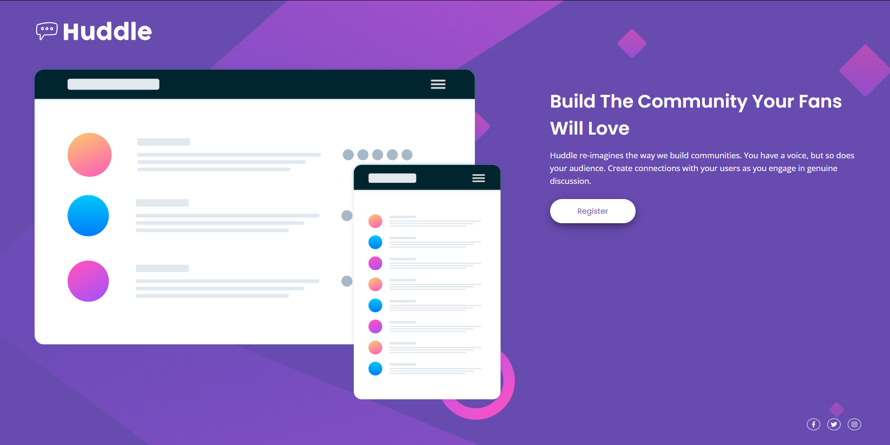

# Frontend Mentor - Huddle landing page with single introductory section solution

This is a solution to the [Huddle landing page with single introductory section challenge on Frontend Mentor](https://www.frontendmentor.io/challenges/huddle-landing-page-with-a-single-introductory-section-B_2Wvxgi0).

## Table of contents

-   [The challenge](#the-challenge)
-   [Screenshot](#screenshot)
-   [Links](#links)
-   [My process](#my-process)
-   [Built with](#built-with)
-   [Author](#author)

### The challenge

Users should be able to:

-   View the optimal layout for the page depending on their device's screen size
-   See hover states for all interactive elements on the page

### Screenshot

### Links

-   Solution URL: [Github](https://www.frontendmentor.io/challenges/huddle-landing-page-with-a-single-introductory-section-B_2Wvxgi0/hub?share=true)
-   Live Site URL: [Vercel](https://huddle-landing-page-five-rust.vercel.app)

## My process

This is my first project. I've been studying HTML and CSS for less than a week. At first, it was quite easy, but during the process, I didn't really know how to handle the image, maybe it will look a bit strange on larger screens. Social media icons were also a bit of a challenge in the beginning, but I figured it out with a little bit of research.

### Built with

-   Semantic HTML5 markup
-   CSS custom properties
-   Flexbox
-   CSS Grid

## Author

-   Linkedin - [Carlos Lima](https://www.linkedin.com/in/carlos-lima-7b31a9269)
-   Frontend Mentor - [@EuOKine](https://www.frontendmentor.io/profile/EuOKine)
